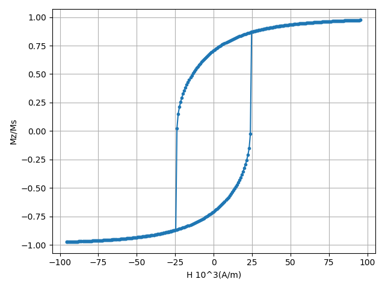

[Stoner–Wohlfarth model](https://en.wikipedia.org/wiki/Stoner%E2%80%93Wohlfarth_model):
When the scale of system is within a exchange length, we can consider the magnetization as a uniform vector,and use the single axis anistropy to simulate the demagnetization.
Set the anistropy axis in xz plane ,with angle $\theta$ to x-axis, and applied field is along positive z-coodinate.That is
```math
E_\mathrm{anis} = - K_{u} (\vec{m} \cdot \hat{u})^2 \\
```
```math
= -K_u\left({m\cos\phi  \cos\theta } + m\sin\phi \sin\theta  \right)^2\\
```

And
```math
E_{zeeman}=-H_zm\cos\phi

```
By solving
```math
\frac{\partial({E_\mathrm{anis}+E_\mathrm{zeeman})}}{\partial\phi}=0
```
We get
```math
\cos(\phi-\theta)\cos(\phi+\theta)=-\frac{H_z}{2K_u}\sin\phi
```
When $H_z=0$, we have
```math
\phi=\theta+\frac{\pi}{2} \quad
or \quad\phi=\theta+\frac{3\pi}{2}
```
There supposed to be a magnetization component along z-axis
Use JuMag to simulate the situation


```julia
using JuMag
using Printf
using NPZ

mesh =  FDMesh(nx=16, ny=16, nz=1, dx=2.5e-9, dy=2.5e-9, dz=2.5e-9)
mT = 0.001 / (4*pi*1e-7)
function dyn_llg(mesh)
sim = Sim(mesh, name="SW_dyn_llg", driver="LLG")
sim.driver.alpha=0.02
sim.driver.precession= false
set_Ms(sim, 1.0e6)
add_exch(sim, 1.3e-11)
init_m0(sim, (1, 0.25, -0.01))
add_anis(sim,3e4,axis=(1,0,1))
z=add_zeeman(sim,(0,0,-120*mT))

for i=-120:1:120
    update_zeeman(z,(0,0,(i)*mT))
    relax(sim, maxsteps=5000, stopping_dmdt=0.01,save_m_every=10000)
end
for i=-120:1:120
    update_zeeman(z,(0,0,(-i)*mT))
    relax(sim, maxsteps=5000, stopping_dmdt=0.01,save_m_every=10000)
end
end

function dyn_sd(mesh)
sim = Sim(mesh, name="SW_dyn_sd", driver="SD")
set_Ms(sim, 1.0e6)
add_exch(sim, 1.3e-11)
init_m0(sim, (1, 0.25, -0.01))
add_anis(sim,3e4,axis=(1,0,1))
z=add_zeeman(sim,(0,0,-120*mT))

for i=-120:1:120
    update_zeeman(z,(0,0,(i)*mT))
    relax(sim, maxsteps=5000, stopping_dmdt=0.01,save_m_every=10000)
end
for i=-120:1:120
    update_zeeman(z,(0,0,(-i)*mT))
    relax(sim, maxsteps=5000, stopping_dmdt=0.01,save_m_every=10000)
end
end

dyn_llg(mesh)
println("Start step 2!")
dyn_sd(mesh)
println("Done!")

```
The llg driver and the steepest descant method give a almost same hysteresis loops,which is plotted below using python scripts:

