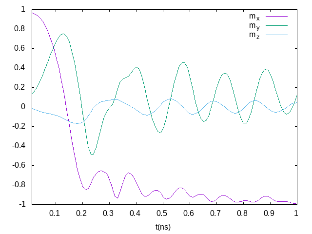

# Tutorial

## An example -- vortex

To start a micromagnetic simulation, we first create a FDMesh

```julia
mesh = FDMesh(dx=2e-9, dy=2e-9, dz=2e-9, nx=100, ny=100)
```

After that, we create a simulation

```julia
sim = Sim(mesh, name="vortex")
```

and set the damping to 0.5 and switch off the precession term in LLG equation:

```julia
sim.driver.alpha = 0.5
sim.driver.precession = false
```

The geometry of the system can be defined by

```julia
set_Ms(sim, circular_Ms)
```

where `circular_Ms` could be a scalar or a function. The function should take six parameters `(i,j,k,dx,dy,dz)`, for instance

```julia
function circular_Ms(i,j,k,dx,dy,dz)
    if (i-50.5)^2 + (j-50.5)^2 <= 50^2
        return 8.6e5
    end
    return 0.0
end
```

We add the exchange interaction and the demagnetization field to the system.

```julia
add_exch(sim, 1.3e-11)
add_demag(sim)
```

We need to initialise the system which can be done by defining a function

```julia
function init_fun(i,j,k,dx,dy,dz)
  x = i-50.5
  y = j-50.5
  r = (x^2+y^2)^0.5
  if r<5
    return (0,0,1)
  end
  return (y/r, -x/r, 0)
end
```

and using

```julia
init_m0(sim, init_fun)
```

To trigger the simulation we relax the system

```julia
relax(sim, maxsteps=1000)
```

## How to enable GPU

Using FDMeshGPU instead of FDMesh to switch on the GPU calculation,

```julia
mesh = FDMeshGPU(dx=2e-9, dy=2e-9, dz=2e-9, nx=100, ny=100)
```

The script to use GPU to obtain the vortex structure is shown below:

```julia
using JuMag
using Printf
using NPZ

JuMag.cuda_using_double(true)
mesh =  FDMeshGPU(dx=2e-9, dy=2e-9, dz=5e-9, nx=100, ny=100, nz=4)

function circular_Ms(i,j,k,dx,dy,dz)
    x = i-50.5
    y = j-50.5
    r = (x^2+y^2)^0.5
    if (i-50.5)^2 + (j-50.5)^2 <= 50^2
        return 8e5
    end
    return 0.0
end

function init_fun(i,j,k,dx,dy,dz)
  x = i-50.5
  y = j-50.5
  r = (x^2+y^2)^0.5
  if r<5
    return (0,0,1)
  end
  return (y/r, -x/r, 0)
end

function relax_system()
  sim = Sim(mesh, driver="SD", name="sim")
  set_Ms(sim, circular_Ms)

  add_exch(sim, 1.3e-11, name="exch")
  add_demag(sim)

  init_m0(sim, init_fun)
  relax(sim, maxsteps=2000, stopping_torque=1.0, save_vtk_every = 100, save_m_every=-1)
  npzwrite("m0.npy", sim.spin)
end

relax_system()
```

## Standard Problem #4
```julia
using JuMag
using Printf
using NPZ

mesh =  FDMeshGPU(nx=200, ny=50, nz=1, dx=2.5e-9, dy=2.5e-9, dz=3e-9)

function relax_system(mesh)
  sim = Sim(mesh, name="std4_relax", driver="SD")
  set_Ms(sim, 8.0e5)
  sim.driver.min_tau = 1e-10

  add_exch(sim, 1.3e-11)
  add_demag(sim)

  init_m0(sim, (1, 0.25, 0.1))

  relax(sim, maxsteps=5000, stopping_torque=10.0)
  npzwrite("m0.npy", Array(sim.spin))
end

function apply_field1(mesh)
  sim = Sim(mesh, name="std4_dyn")
  set_Ms(sim, 8.0e5)
  sim.driver.alpha = 0.02
  sim.driver.gamma = 2.211e5

  mT = 0.001 / (4*pi*1e-7)
  add_exch(sim, 1.3e-11)
  add_demag(sim)
  add_zeeman(sim, (-24.6*mT, 4.3*mT, 0))

  init_m0(sim, npzread("m0.npy"))

  for i=1:100
    run_until(sim, 1e-11*i)
  end
end

relax_system(mesh)
println("Start step2 !!!")
apply_field1(mesh)
println("Run step2 again!!!")
@time apply_field1(mesh)
println("Done!")
```

The output file is a simple text compatible with [Gnuplot](http://www.gnuplot.info/), like used for plot below.


